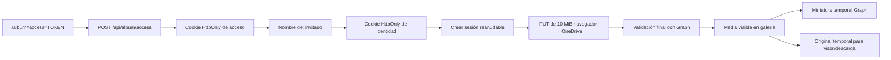

# Arquitectura del álbum colaborativo

## Objetivo y límites

El álbum es una vertical independiente bajo `/album`. No modifica el componente que sirve `/`. Los invitados acceden con un secreto en el fragmento URL, indican solamente su nombre y pueden subir, ver y descargar fotografías o vídeos. OneDrive conserva los originales sin transformarlos.

Quedan deliberadamente fuera del MVP: comentarios, reacciones, moderación, ZIP, transcodificación, `sharp`, `ffmpeg`, workers, CDN y persistencia de reanudación tras recargar el navegador.

## Flujo

El token del fragmento se elimina con `history.replaceState` antes de llamar al servidor y nunca se guarda en `localStorage`, `sessionStorage` ni logs. Después del intercambio, todas las decisiones de acceso usan cookies firmadas `HttpOnly`, `SameSite=Lax` y `Secure` en producción.

## Componentes

- `src/pages/AlbumPage.tsx`: bootstrap del acceso y composición de la experiencia.
- `src/components/album/GuestGate.tsx`: identidad mínima y accesible.
- `src/components/album/UploadPanel.tsx`: selector, cola, progreso y controles.
- `src/lib/upload-queue.ts`: concurrencia dos, fragmentos secuenciales, retry limitado, cancelación idempotente y reanudación mientras el objeto `File` siga vivo.
- `src/components/album/GalleryGrid.tsx`: cursor, miniaturas y cuadrícula 2/3/4 columnas.
- `src/components/album/MediaViewer.tsx`: imagen, vídeo, teclado y descarga.
- `src/pages/AlbumAdminPage.tsx`: sesión de administrador y conexión Microsoft.
- `server/app.ts`: API, cookies, validación, rate limits, CSP y entrega de la SPA.
- `server/graph.ts`: OAuth, refresh token cifrado y llamadas a Microsoft Graph.
- `server/store.ts`: contrato de persistencia y fallback en memoria.
- `server/mysql-store.ts`: implementación MySQL.

## API propia

| Método | Ruta | Función |
|---|---|---|
| `POST` | `/api/album/access` | Intercambia el token por cookie de acceso |
| `GET` | `/api/album/session` | Devuelve acceso e identidad, nunca secretos |
| `POST/PATCH/DELETE` | `/api/album/guest` | Crea, renombra o elimina la identidad local; renombrar conserva el identificador propietario |
| `GET` | `/api/album/uploads/policy` | Límites y MIME admitidos |
| `POST` | `/api/album/uploads/session` | Reserva cuota y crea sesión Graph |
| `POST` | `/api/album/uploads/:id/complete` | Valida nombre, tamaño y carpeta antes de publicar |
| `POST` | `/api/album/uploads/:id/fail` | Marca una subida cancelada o fallida |
| `GET` | `/api/album/media` | Página de 20 visibles mediante cursor estable; admite `scope`, `kind`, `sort` y `direction` |
| `GET` | `/api/album/media/:id/source` | URL temporal del original |
| `DELETE` | `/api/album/media/:id` | El propietario oculta la media y mueve el original a la papelera de OneDrive |
| `POST` | `/api/admin/session` | Crea sesión administrativa corta |
| `GET` | `/api/admin/microsoft/connect` | Inicia OAuth con PKCE |
| `GET` | `/api/admin/microsoft/callback` | Guarda el refresh token cifrado |
| `POST` | `/api/admin/microsoft/test` | Crea y valida el fichero de prueba |

## OneDrive

Se solicita únicamente `offline_access` y el permiso delegado `Files.ReadWrite`; no se solicita `User.Read`. El endpoint OAuth usa el tenant `consumers`, pensado para cuentas Microsoft personales. Access y refresh tokens nunca se envían al navegador. El refresh token se persiste cifrado con AES-256-GCM y puede rotar durante un refresh.

El navegador sí recibe una `uploadUrl` temporal, porque actúa como capability para transferir bytes directamente. Vive solo en memoria. Los fragmentos son de 10 MiB, múltiplo de 320 KiB. El último `PUT` devuelve el `driveItem`; el backend vuelve a consultar Graph y comprueba nombre almacenado, tamaño y carpeta padre antes de cambiar `uploading` a `visible`.

Los thumbnails se solicitan en lotes de hasta 20 subrequests mediante `POST /v1.0/$batch`. Cada subrequest usa la colección oficial `GET /me/drive/items/{itemId}/thumbnails`; se elige `large`, después `medium` y finalmente `small`. Una colección vacía o el fallo aislado de una subrequest produce `thumbnailUrl: null`, nunca el fallo de toda la galería. La UI muestra un placeholder y, para vídeo sin poster, una tarjeta genérica de vídeo.

La descarga múltiple abre directamente las URLs temporales de Microsoft con una sola acción del usuario; la política de autorización de varias descargas pertenece al navegador. El ZIP sigue fuera del alcance hasta medir en staging los límites reales de CPU, RAM, I/O, disco temporal, duración de petición y tamaño total; el número de archivos por sí solo no determina un límite seguro.

Cada chunk admite tres reintentos automáticos adicionales para errores de red, `429`, `500`, `502`, `503` y `504`, con backoff aproximado de 1, 2 y 4 segundos, jitter pequeño y respeto de `Retry-After`. Antes de reenviar tras un fallo ambiguo se consulta la upload session y se usa `nextExpectedRanges`; no se incrementa el offset suponiendo que el `PUT` falló. Los demás estados HTTP pasan directamente al retry manual.

La identidad propietaria es un UUID aleatorio guardado únicamente dentro de la cookie firmada de invitado. Cambiar el nombre renueva esa cookie sin cambiar el UUID, por lo que **Mis recuerdos** y los permisos de borrado permanecen estables. El servidor nunca acepta un identificador propietario enviado por el frontend. El borrado exige que el UUID firmado coincida, llama a `DELETE /me/drive/items/{itemId}` y solo después marca la fila como `deleted`; Microsoft mueve el original a la papelera de OneDrive. Un `404` de Graph se considera un borrado ya completado para permitir reintentos seguros.

## Persistencia

`MysqlStore` crea al iniciar las tablas mínimas `media` y `oauth_tokens`, ambas con `utf8mb4`, y abre un pool pequeño con zona horaria UTC. El bootstrap es idempotente, migra de forma aditiva el estado `deleted`, los campos de captura y los índices de subida, captura, invitado y MIME. La galería usa cursores opacos ligados a orden, dirección, tipo y ámbito; cada cursor conserva la clave primaria de ordenación más `(createdAt,id)`, evitando duplicados o saltos incluso cuando varias filas comparten fecha, tipo o invitado.

La galería puede filtrar fotos o vídeos y ordenar por fecha de subida, fecha de captura, tipo o invitado. Antes de crear la sesión de subida, el navegador extrae `DateTimeOriginal` de JPEG o la fecha de creación `mvhd` de MP4/MOV/M4V leyendo solo metadata local. Si no existe, utiliza `File.lastModified` como fallback identificado; si tampoco es válido, guarda fecha desconocida. Durante `/complete`, el `photo.takenDateTime` que proporcione Graph tiene prioridad, lo que cubre formatos fotográficos que el navegador no analiza directamente, como HEIC/HEIF. Solo se envía la fecha normalizada a Express: los bytes siguen yendo directamente a OneDrive y el original conserva intacta su metadata embebida.

MySQL conserva la metadata de media y una única conexión Microsoft. Solo se persiste el refresh token cifrado con AES-256-GCM; el access token permanece en memoria. Al recibir `SIGINT` o `SIGTERM`, el backend cierra el servidor HTTP y ejecuta `pool.end()`. Reiniciar Node conserva la galería y permite obtener nuevos access tokens desde el refresh token cifrado.

`MemoryStore` existe únicamente para desarrollo y emite `[album] Running with volatile development storage`. MySQL solo se considera configurado cuando existen `MYSQL_HOST`, `MYSQL_PORT`, `MYSQL_DATABASE`, `MYSQL_USER` y `MYSQL_PASSWORD`; una configuración parcial es un error. En `NODE_ENV=production`, la ausencia de cualquiera de esas variables impide arrancar para no usar almacenamiento volátil silenciosamente.

## Seguridad

- Helmet con CSP, `frame-ancestors 'none'`, `object-src 'none'`, sin workers y política de referrer estricta.
- Respuestas privadas de API con `Cache-Control: private, no-store`.
- `X-Robots-Tag` y metadato `robots` específicos del álbum.
- Comparación de claves con tiempo constante; cookies firmadas y expirables.
- PKCE y `state` firmado en OAuth.
- Validación Zod, nombres de archivo saneados, UUID y política MIME/extensión común enviada por el backend. Se admiten `.jpg`, `.jpeg`, `.png`, `.heic`, `.heif`, `.webp`, `.gif`, `.mp4`, `.mov` y `.m4v`; MIME vacío o genérico requiere extensión permitida, y un MIME conocido debe coincidir con ella.
- Rate limits separados para acceso, administración, subida, finalización y galería.
- Defensa de `Origin`/`Sec-Fetch-Site` en mutaciones autenticadas por cookie.
- Reserva mínima conservadora de 20 GiB en OneDrive.
- URLs temporales e identificadores internos de OneDrive no se registran.

La CSP no fija hostnames temporales concretos. `img-src` y `media-src` permiten únicamente las familias restringidas usadas por thumbnails y originales de OneDrive (`*.1drv.com`, `*.sharepoint.com` y `*.microsoftpersonalcontent.com`). `connect-src` conserva solo el mismo origen y las familias necesarias para la `uploadUrl` directa; Microsoft Graph se consulta desde Express y no necesita permiso CSP del navegador. Microsoft documenta las URLs preautenticadas como efímeras, pero no garantiza un hostname estable, por lo que estos patrones deben revisarse de nuevo en staging sin ampliarlos a `https:`, `*` o `*.microsoft.com`.

## Limitaciones conocidas

- La reanudación funciona mientras la pestaña conserve el objeto `File`; una recarga exige volver a elegirlo.
- La transferencia directa impide inspeccionar magic bytes o ejecutar antivirus en el servidor. Se comprueban MIME declarado, extensión, tamaño y metadatos finales de Graph.
- Las miniaturas dependen de la disponibilidad y formatos que Microsoft Graph pueda representar.
- Los rate limits son locales al proceso. Si se despliegan varias réplicas deben moverse a un almacén compartido.
- No existe reconciliación automática si alguien mueve o elimina manualmente un original en OneDrive.
- Un thumbnail temporal puede tardar en estar disponible en Graph; la tarjeta conserva su placeholder hasta una recarga posterior.
- La propiedad depende de la cookie firmada del navegador. Borrar las cookies, usar otro dispositivo o dejar que caduque la identidad impide gestionar como propios los recuerdos anteriores; no existe cuenta personal ni recuperación de identidad en este MVP.

## Recovery / orphaned uploads

Existe una ventana residual: el último `PUT` puede terminar correctamente en OneDrive, guardar el archivo y perderse después el `POST /complete`. Si además el usuario cierra el navegador, el original puede quedar en OneDrive mientras el registro de media permanece en `uploading`.

No se implementa reconciliación automática en esta iteración. Una mejora futura será una acción administrativa explícita **Repair gallery / reconcile** que compare la carpeta configurada de OneDrive con la tabla de media y permita resolver diferencias. No requiere workers, cron ni colas para el MVP actual.
