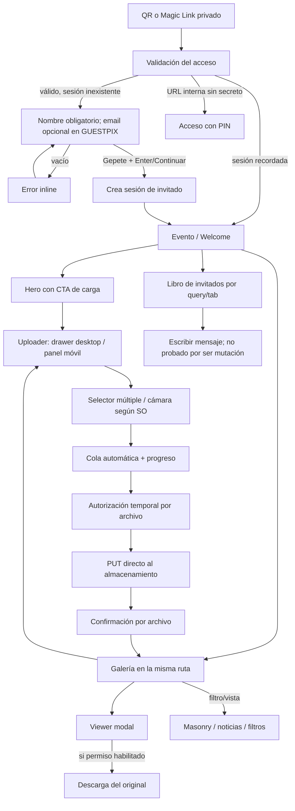
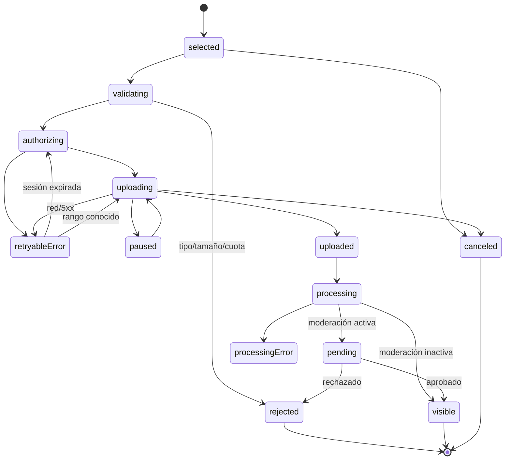

# Auditoría funcional del flujo de invitado de GUESTPIX

Fecha de observación: 30 de agosto de 2026  
Ámbito: flujo de invitado del álbum de prueba, sin acceso al panel de anfitrión  
Identidad usada: `Gepete`  
Principio: especificación funcional original; no se ha copiado código, CSS, HTML, bundles, secretos ni branding.

## Convenciones de evidencia

- **OBSERVADO**: comprobado directamente en el álbum facilitado.
- **DOCUMENTADO**: afirmado por documentación pública oficial, pero no comprobable en este plan/configuración.
- **INFERIDO**: conclusión razonable basada en red, DOM o comportamiento; puede requerir validación adicional.
- **RECOMENDACIÓN**: diseño propuesto para nuestra web.
- **NO DETERMINADO**: no existe evidencia suficiente o la prueba no era prudente.

## 1. Executive Summary

GUESTPIX acierta sobre todo en reducir la fricción: QR/Magic Link, nombre, y acceso inmediato a una página que combina bienvenida, carga y galería. No exige cuenta, aplicación ni PIN cuando se usa el enlace correcto. La sesión se recuerda mediante cookies seguras y HttpOnly; el nombre se asocia a una sesión interna, no actúa como identificador único. Dos navegadores pueden llamarse `Gepete` y seguir siendo invitados distintos.

La carga es el patrón que más merece replicarse. El selector múltiple inicia automáticamente la cola, muestra cada fichero, tamaño, miniatura, progreso agregado y controles de cancelación/pausa. En la prueba, el cliente obtuvo dos autorizaciones temporales, realizó dos `PUT` directos y concurrentes al almacenamiento y confirmó cada elemento al backend. Los bytes no atravesaron el servidor principal de GUESTPIX. Esto encaja con nuestra arquitectura de OneDrive, con una diferencia importante: para archivos grandes debemos usar sesiones reanudables de Microsoft Graph y fragmentos secuenciales.

La galería usa un masonry responsivo, tarjetas con reacciones/comentarios y atribución por nombre en móvil. Las representaciones de galería son distintas del original: un PNG de prueba fue transferido como PNG pero apareció posteriormente mediante un derivado JPG. La documentación oficial confirma que los originales se conservan y que la galería usa miniaturas comprimidas. Nuestro diseño debe separar de forma estricta `original` y `preview`; OneDrive será el sistema de registro de los originales y una caché de derivados servirá las vistas rápidas.

En desktop el acceso es una tarjeta horizontal de dos columnas sobre una portada desenfocada; el uploader es un panel lateral derecho. En móvil, portada y formulario se apilan, el header se compacta, la galería pasa a una columna y el uploader ocupa casi todo el ancho como panel/modal. La funcionalidad es equivalente, pero no es una mera reducción proporcional: cambian composición, navegación y densidad.

Los puntos que no conviene copiar son el exceso de contenido comercial/footer, una portada demasiado alta antes de la galería, el visor pequeño en móvil, controles icon-only poco claros y varios problemas de accesibilidad: el visor no cerró con Escape, no atrapó el foco y su cierre no expuso un nombre accesible. Tampoco debemos copiar la coexistencia de textos en dos idiomas.

Riesgos principales de nuestra versión:

1. Exponer el token de Microsoft Graph o una URL de sesión de carga en logs/analítica.
2. Tratar el nombre como autorización en lugar de usar una sesión opaca.
3. Perder reanudación en vídeos 4K/grandes.
4. Servir originales en el grid y degradar rendimiento/datos móviles.
5. Aceptar extensiones sin verificar firma MIME, tamaño, cuotas y ownership.
6. Confundir visibilidad con moderación; son ejes independientes.

El repositorio inspeccionado contiene React/Vite/Tailwind, navegación local de la invitación y RSVP, pero **no contiene en este checkout** rutas de álbum, sesión de invitado, uploader, galería, visor, API TypeScript ni integración OneDrive. Por tanto, el siguiente paso recomendado es implementar una vertical P0 aislada bajo una ruta propia, manteniendo intacta la web de boda existente.

## 2. Evidence & Methodology

### Método

- Perfiles efímeros, sin reutilizar cookies ni storage.
- Chromium: 1440×900, 1920×1080, 390×844 y 412×915.
- WebKit: 390×844 para contraste tipo Safari.
- Nombre exacto `Gepete`; email vacío.
- Dos ficheros creados exclusivamente para la prueba:
  - `codex-test-photo-01.jpg` — 182,422 bytes.
  - `codex-test-photo-02.png` — 42,562 bytes.
- Network/DOM/storage inspeccionados de forma pasiva. Las URLs firmadas, cookies e identificadores están enmascarados.
- No se compró ningún plan, no se accedió al host, no se borró contenido, no se alteraron permisos y no se probaron otros eventos.
- Capturas: [`docs/guestpix-audit/`](./guestpix-audit/). Registros sanitizados: [`docs/guestpix-audit/evidence/`](./guestpix-audit/evidence/).

### Tabla de evidencias

| ID | Evidencia | Origen | Desktop/Mobile | Confianza |
|---|---|---|---|---|
| E01 | Magic Link conduce al formulario de identificación sin PIN | Observado | Ambos | Alta |
| E02 | La URL canónica interna sin secreto solicita contraseña/PIN en una sesión limpia | Observado | Mobile | Alta |
| E03 | Nombre vacío produce error inline; el input no usa `required` nativo | Observado | Ambos | Alta |
| E04 | Enter con `Gepete` ejecuta login y navega a la experiencia del evento | Observado | Ambos | Alta |
| E05 | Se crean dos cookies funcionales HttpOnly, Secure, SameSite=Lax con persistencia aproximada de un año | Observado | Ambos | Alta |
| E06 | Recarga y reapertura del Magic Link no vuelven a pedir nombre en el mismo contexto | Observado | Ambos | Alta |
| E07 | Contexto nuevo vuelve a pedir nombre | Observado | Ambos | Alta |
| E08 | Varias sesiones independientes aceptaron el mismo display name | Observado | Ambos | Alta |
| E09 | Welcome y Gallery son secciones de una misma ruta; uploader añade query state | Observado | Ambos | Alta |
| E10 | Selector: múltiples imágenes JPG/PNG/BMP/GIF/WebP/HEIC/HEIF; sin vídeo en Free | Observado | Ambos | Alta |
| E11 | Seleccionar dos fotos inicia carga automática y concurrente | Observado | Desktop | Alta |
| E12 | Patrón de red: autorización temporal → `PUT` directo → confirmación | Observado | Desktop | Alta |
| E13 | Preview posterior en JPG para un original PNG | Observado | Ambos | Alta |
| E14 | Grid masonry: cuatro columnas desktop y una columna móvil en las capturas | Observado | Ambos | Alta |
| E15 | Tarjetas móviles muestran autor, reacciones y comentarios | Observado | Mobile | Alta |
| E16 | Visor modal; Escape no lo cerró y el foco no quedó atrapado | Observado | Ambos | Alta |
| E17 | No apareció descarga individual ni ZIP en este álbum | Observado | Ambos | Alta |
| E18 | Media API paginada observable; no se pudo demostrar infinite scroll con pocos elementos | Observado/No determinado | Ambos | Media |
| E19 | No hay `meta robots`, `X-Robots-Tag`, CSP ni frame policy observables en la entrada; `/robots.txt` devuelve la shell HTML | Observado | Mobile | Alta |
| E20 | Free admite hasta 50 fotos y no vídeos | Documentación oficial | N/A | Alta |
| E21 | Moderación: pendiente visible para uploader+host, no para otros | Documentación oficial | N/A | Alta |
| E22 | Descargas habilitadas entregan original; ZIP puede agrupar por invitado | Documentación oficial | N/A | Alta |

### Límites

- Teclado virtual, bloqueo físico del teléfono, background prolongado, pérdida real de red, orientación landscape, pinch-to-zoom y cámara nativa no son reproducibles fielmente en headless: **NO DETERMINADO**.
- No se provocaron archivos gigantes, payloads maliciosos, expiración, rate limits, fallos parciales ni límite de 50 fotos.
- La galería era pequeña; la paginación se observó en red, pero no se alcanzó el siguiente lote mediante scroll.
- Las pruebas de viewer se realizaron sobre fotografías. No había vídeo disponible.

### Fuentes oficiales consultadas

- [Acceso con Magic Link y QR](https://help.guestpix.com/article/92-which-link-do-i-share-what-is-difference-between-the-magic-link-pin-protected-url)
- [Flujo de carga del invitado](https://help.guestpix.com/article/35-how-do-guests-upload-to-my-digital-guestpix-gallery)
- [Formatos admitidos](https://help.guestpix.com/article/23-what-photo-and-video-types-can-a-guest-upload)
- [Tamaño y lote máximos](https://help.guestpix.com/article/52-whats-the-maximum-file-size-i-can-upload-to-guestpix)
- [Contenido del plan gratuito](https://help.guestpix.com/article/189-what-is-inlcuded-in-a-free-gallery)
- [Originales y previews](https://help.guestpix.com/article/22-when-i-download-my-gallery-will-i-receive-the-full-resolution-photos-and-videos-or-a-compressed-version)
- [Descargas de invitado](https://help.guestpix.com/article/46-can-guests-download-from-the-gallery)
- [Moderación](https://help.guestpix.com/article/174-what-is-content-moderation-on-guestpix-and-how-does-it-work)
- [Visibilidad de galería](https://help.guestpix.com/article/55-can-a-host-approve-photos-videos-before-sharing)
- [Microsoft Graph: sesión reanudable](https://learn.microsoft.com/en-us/graph/api/driveitem-createuploadsession?view=graph-rest-1.0)
- [Microsoft Graph: descarga de contenido](https://learn.microsoft.com/en-us/graph/api/driveitem-get-content?view=graph-rest-1.0)

## 3. Complete User Journey



### Transiciones y Back

| Desde | Acción | Destino/estado | Ruta observable | Atrás/persistencia |
|---|---|---|---|---|
| Magic Link | Abrir | Gate | `/guest/access/{eventId}/{secretToken}` → variante interna equivalente | Fresh pide nombre |
| Gate | Enter/Continuar | Evento | `/guest/{eventId}/` | Sesión persiste |
| URL canónica sin secreto, fresh | Abrir | Login PIN | `/guest/{eventId}/login` | No concede acceso |
| Evento | Cargar | Drawer/modal | Misma ruta con `?upload=true` | El estado está representado en URL; Back debería cerrarlo, no se certificó |
| Evento | Libro de invitados | Sección/tab | `?tab=guestbook` | Back vuelve al estado anterior; inferido por query |
| Grid | Tap/click foto | Viewer modal | Ruta estable | Escape no cerró; cierre visual sí |
| Sesión existente | Reabrir Magic Link | Evento | Termina en canonical sin secreto | No vuelve a pedir nombre |

## 4. Screen Inventory

1. **Access Gate / identificación** — observado.
2. **Evento / hero de bienvenida** — observado.
3. **Galería, vista Cuadrícula** — observado.
4. **Galería, vista Noticias** — control observado; contenido no diferenciado de forma fiable en automatización.
5. **Filtros** — control y badge observados; panel interno no determinado.
6. **Uploader vacío** — observado.
7. **Uploader cargando** — observado.
8. **Uploader completado/reset** — observado; vuelve al dropzone.
9. **Viewer de foto** — observado.
10. **Viewer de vídeo** — no disponible en Free.
11. **Libro de invitados** — observado, con CTA para escribir; no se publicó mensaje.
12. **Composer de libro de invitados** — existencia inferida por CTA; no abierto para evitar mutación accidental.
13. **Menú móvil** — botón y enlaces observados; drawer completo no determinado.
14. **Descarga individual / menú More** — no visible en este álbum; documentado cuando el host lo habilita.
15. **Descarga ZIP** — no visible; documentado cuando el host habilita y genera ZIP.
16. **Estados de moderación** — no activados aquí; documentados.
17. **Límite de plan/upgrade** — restricción de vídeo observable por `accept`; límite de 50 documentado; no se alcanzó.

## 5. Screen-by-Screen Specification

### 5.1 Access Gate

**Propósito.** Convertir el acceso por enlace en una sesión recordada y capturar atribución humana mínima.

**OBSERVADO — desktop.** Header simple con título del evento. Fondo de portada desenfocado; tarjeta centrada de aproximadamente 1,200 px y dos columnas equivalentes. Columna izquierda: nombre del evento, encabezado de mensaje, texto del anfitrión, nombre, email opcional, CTA y enlaces legales. Columna derecha: imagen de portada. Footer completo debajo.

**OBSERVADO — mobile.** Header de ~80 px; portada horizontal de ancho completo; formulario en card con márgenes de ~16 px; legales y footer apilados. Ya no existe split-card.

**Campos/acciones.** Nombre y email. En nuestra versión se elimina completamente email. `Enter` funciona. El CTA muestra estado deshabilitado/loading con spinner durante login.

**Estados.** Initial, focused, empty error, submitting, access rejected/expired (no probado). Mensaje observado para vacío: error inline bajo el nombre. El input no declara `required`, `minLength` ni `maxLength`; la validación es de aplicación.

**Validaciones.** Vacío probado. Espacios, longitud extrema, emoji y caracteres españoles: **NO PROBADO**. Nuestra versión debe `trim`, normalizar NFC, exigir 1–80 grafemas visibles, permitir español/emoji, rechazar solo controles/bidi peligrosos y conservar el display name original normalizado.

**Accesibilidad.** Labels `for` correctos y tab order lógico. Mejorar con `required`, `aria-describedby`, `aria-invalid`, `autocomplete="name"` y anuncio de loading/error.

### 5.2 Evento / Welcome

**Propósito.** Confirmar el contexto del evento y presentar el CTA primario.

**OBSERVADO.** Header, portada blur, thumbnail circular, fecha, título, mensaje y CTA de carga. Un CTA secundario ofrece recordatorio. Debajo aparece un strip promocional y las tabs Galería/Libro. No hay una pantalla Home separada de la galería; es una página larga.

**Desktop.** Hero ancho, contenido alineado en un contenedor de ~1,200 px. Galería inmediatamente debajo. Header muestra idioma a la derecha.

**Mobile.** Header compacto con hamburguesa. Hero ocupa gran parte del primer viewport; thumbnail y texto se reducen. El usuario debe hacer scroll para ver la galería.

**Nuestra implementación.** Reducir el hero en móvil para que el primer thumbnail quede visible o asome; eliminar promoción, selector de idioma y footer comercial. Mantener título, fecha, CTA grande y acceso directo a galería.

### 5.3 Galería

**Propósito.** Descubrir contenido y volver a cargar sin cambiar de contexto.

**OBSERVADO.** Tabs; uploader repetido en toolbar; switches Cuadrícula/Noticias; Filtros con badge; Ayuda. Masonry conserva ratios portrait/landscape. En desktop se ven cuatro columnas en 1440/1920; en móvil una columna. Cada tarjeta móvil incluye imagen, corazón, comentarios/reacciones y nombre del invitado. Los dos dummies posteriores aparecieron asociados a `Gepete`.

**Estados.** Loading con GIF/spinner; populated; item recién subido; filtro; vista alternativa. Empty, imagen rota, siguiente página y refresh automático: no determinados.

**Orden.** Los dummies recién subidos se solicitaron después en el listado y aparecieron al principio; **INFERIDO** orden descendente por subida. No se observó agrupación.

**Paginación.** Se observó un GET con `page`/`perPage`; **OBSERVADO** soporte de paginación en backend. Infinite scroll no demostrado.

**Actualización.** Tras completar, el cliente volvió a pedir media y tras reload se vieron los nuevos previews. No se observaron WebSockets/SSE; **INFERIDO** invalidación/refetch, no push en tiempo real.

**Nuestra implementación.** Cursor estable `(createdAt,id)`, stale-while-revalidate, polling ligero solo mientras la vista está visible o tras upload, skeletons con ratio reservado, `IntersectionObserver`, `content-visibility`, y optimistic placeholder local hasta que el preview esté listo.

### 5.4 Uploader

**Propósito.** Seleccionar y transferir varios originales con feedback.

**Desktop.** Drawer derecho fijo de ~460–500 px, fondo atenuado, dropzone amplia.

**Mobile.** Panel/modal casi de ancho completo, sin dropzone lateral. El selector del sistema se encarga de biblioteca/cámara.

**Componentes observados.** Título, cierre, checkbox de omitir duplicados (checked), ayuda, dropzone/browse, input múltiple, thumbnails, filename, size, add-more, remove item, cancel global, pausa/cancelación cerca del progreso, total transferido y tiempo restante.

**Comportamiento.** La carga arranca automáticamente al seleccionar; no existe una pantalla de confirmación previa prolongada. Los dos archivos comenzaron con autorizaciones y transferencias paralelas. Al terminar, el panel regresó al dropzone; no se capturó toast persistente.

**Nuestra implementación.** Mantener auto-start, pero permitir una preferencia “Revisar antes de subir” no necesaria en MVP. Eliminar el confuso “omitir duplicados” del flujo invitado: deduplicar por hash/size internamente y permitir al usuario confirmar si el fichero ya existe.

### 5.5 Viewer

**OBSERVADO.** Modal con fondo atenuado, imagen `contain` y cierre circular arriba-derecha. No hubo flechas, contador, filename, autor, fecha, fullscreen ni descarga en este álbum. No se demostró swipe/zoom. En móvil también es un modal pequeño, no fullscreen.

**Accesibilidad observada.** Escape no cerró; Tab siguió por controles de la página; no hubo focus trap; el botón de cierre no expuso nombre en el listado accesible. Son deficiencias que no debemos replicar.

**Nuestra implementación.** Fullscreen en móvil, `Dialog` accesible, cierre con Escape, focus trap/restore, swipe horizontal, teclado, contador, autor/fecha, zoom hasta 4×, `prefers-reduced-motion`, descarga condicional y player nativo para vídeo.

### 5.6 Libro de invitados

**OBSERVADO.** Query `?tab=guestbook`, título, retorno a galería y CTA para dejar un mensaje; el texto indica que el mensaje solo lo ve el anfitrión. No se publicó nada.

**Nuestra implementación.** Fuera del P0 de media. Si se añade, separar visibilidad de mensajes y galería y aplicar rate limit/anti-spam.

### 5.7 Component specification summary

| Component | Purpose | Inputs | Actions | States | Desktop | Mobile | Accessibility / nuestra implementación |
|---|---|---|---|---|---|---|---|
| GuestGate | Crear sesión | displayName, access bootstrap | submit | idle/error/loading | split card | stack | Form semántico, errores anunciados |
| AlbumHero | Contexto+CTA | event | upload, scroll | loading/closed | amplio | compacto | Un H1; CTA ≥44 px |
| GalleryToolbar | Vistas/filtros | settings | upload/view/filter | active/disabled | horizontal | iconos compactos | Labels visibles o aria-label |
| MediaGrid | Explorar | pages | open/load more | loading/empty/error | masonry 4 col | 1 col | Orden DOM coherente |
| MediaCard | Preview+autor | media | open/react/comment | pending/visible/broken | hover | touch | Button con alt útil |
| UploadPanel | Cola | File[] | add/cancel/retry | state machine | drawer | sheet/fullscreen | progreso por texto+bar |
| MediaViewer | Ver/descargar | media cursor | nav/zoom/download | image/video/error | modal grande | fullscreen | Focus trap, Escape, swipe |
| ToastProvider | Feedback | events | dismiss | info/success/error | esquina | safe-area bottom | `aria-live` controlado |

## 6. Desktop vs Mobile

| Elemento | Desktop | Mobile | Nuestra implementación |
|---|---|---|---|
| Gate | Card horizontal 50/50 sobre blur | Portada seguida de card | Mantener transformación |
| Header | Título + idioma | Título + menú | Sin idioma; menú mínimo |
| Hero | Alto, contenido horizontal | Alto y apilado | Reducir a ~60–70vh móvil |
| CTA upload | En hero y toolbar | En hero y toolbar compacta | Sticky action opcional al bajar |
| Galería | Masonry ~4 columnas | 1 columna | 1 / 2 / 3 / 4 por breakpoints |
| Toolbar | Controles con texto | Iconos densos | Icono+tooltip/aria; texto donde quepa |
| Uploader | Drawer derecho | Sheet/modal ancho | Fullscreen móvil con safe areas |
| Viewer | Modal centrado | Modal pequeño | Fullscreen móvil |
| Footer | Columnas | Apilado largo | Footer corto de boda |
| Hover | Aplicable a cards | No | Nunca ocultar acciones solo en hover |
| Touch | N/A | Targets desiguales | Mínimo 44×44 px |
| Safe area | No relevante | No determinada | `env(safe-area-inset-*)` |
| Teclado | Enter observado | No virtual real | CTA visible con `dvh`, scrollIntoView |

### Breakpoints propios recomendados

- `< 640`: una columna, uploader fullscreen, toolbar compacta.
- `640–767`: dos columnas si los ratios lo permiten; panel fullscreen/large sheet.
- `768–1023`: dos o tres columnas, drawer de ~420 px.
- `1024–1279`: tres columnas.
- `>= 1280`: cuatro columnas, contenedor máximo 1,280 px.

No se pretende reproducir el config de Tailwind de GUESTPIX.

## 7. Guest Identity System

### Modelo observable

1. Magic Link valida evento/secreto.
2. Si no existe sesión, se solicita nombre.
3. Login crea cookies funcionales HttpOnly/Secure/SameSite=Lax.
4. No hay ID funcional en localStorage legible por JS; localStorage guarda preferencias/estado auxiliar.
5. La cookie de evento y otra cookie de IDs persistieron aproximadamente un año.
6. Reload y Magic Link reutilizan la sesión.
7. Un contexto fresh repite identificación.
8. La URL interna sin secreto, abierta fresh, redirige a formulario con passcode.
9. El mismo display name en varias sesiones es válido. **INFERIDO:** backend usa ID de sesión distinto y el nombre es solo atributo.

### Nuestra versión

- El Magic Link establece un **bootstrap de acceso** corto y redirige inmediatamente a una URL sin secreto.
- `POST /guest-sessions` crea `guestSessionId` aleatorio y cookie `HttpOnly; Secure; SameSite=Lax; Path=/album`.
- Nunca usar nombre como clave, ni mostrar conflicto por duplicado.
- Guardar token de Magic Link como hash (p. ej. SHA-256/HMAC), nunca plaintext.
- Renovación sliding limitada hasta fin del evento + periodo de gracia; botón “Este no soy yo” para reiniciar nombre sin cerrar el álbum.
- Otro dispositivo con `Gepete` es otra sesión, con ownership propio.

## 8. Upload System

### UX observada

- Input `files[]`, `multiple=true`.
- Free `accept`: JPEG, PNG, BMP, GIF, WebP, HEIC/HEIF; sin `capture` explícito y sin vídeo.
- Documentación: el SO puede ofrecer biblioteca o cámara; múltiples ficheros.
- Auto-start tras selección.
- Fila por archivo con nombre, size, thumbnail y remove.
- Total/tiempo restante, cancelación y pausa visible.
- Dos uploads concurrentes.
- Panel sigue abierto; fondo bloqueado por overlay.
- Completion resetea el panel y refresca media.

### Arquitectura observable

```text
Cliente ── autorización temporal por archivo ──► API
Cliente ◄─ URL temporal ─────────────────────── API
Cliente ── PUT original ──────────────────────► almacenamiento
Cliente ── confirmación por archivo ──────────► API
API/worker ── preview derivado ───────────────► galería/CDN
```

No se observaron multipart ni bytes atravesando la API principal. No hubo chunking para estos ficheros pequeños. Resumable para GUESTPIX: **NO DETERMINADO**. Polling/WebSocket/SSE de progreso: no observado; el progreso provino del XHR de subida.

### State machine recomendada



### OneDrive y conservación exacta

**RECOMENDACIÓN.** El backend crea una sesión reanudable de Graph y entrega al cliente solo su `uploadUrl` preautorizada, nunca el access/refresh token de Microsoft. El cliente sube rangos secuenciales de 5–10 MiB, múltiplos de 320 KiB, persiste `uploadId`, offset y fingerprint en IndexedDB y consulta `nextExpectedRanges` al reanudar. Graph recomienda upload reanudable para ficheros mayores de 10 MiB.

El original debe ir a una ruta server-generated, por ejemplo:

```text
/WeddingMedia/originals/{eventId}/{mediaId}/{sanitizedDisplayName}.{ext}
```

No usar el filename del invitado como path autoritativo. Guardarlo como metadata. Tras commit, registrar `driveItemId`, size, eTag/cTag y hash SHA-256 calculado idealmente en cliente/worker y verificado por streaming cuando sea viable. Nunca convertir ni sobrescribir el original.

Los previews viven aparte:

```text
/WeddingMedia/previews/{eventId}/{mediaId}/w480.webp
/WeddingMedia/previews/{eventId}/{mediaId}/w1280.webp
/WeddingMedia/posters/{eventId}/{mediaId}.jpg
```

Para rendimiento, es preferible servir previews desde object storage/CDN separado; OneDrive sigue siendo el archivo maestro. Si no se añade ese servicio, almacenar derivados en una carpeta separada de OneDrive y cachearlos agresivamente tras un endpoint propio.

### Edge cases de carga

- 0 files: no crear sesión.
- Duplicate click: idempotency key por batch/file.
- Mismo filename: `mediaId` único; nunca overwrite.
- Partial success: cada item concluye independientemente.
- Reload: restaurar queue desde IndexedDB y consultar rango.
- Expired session: backend reautoriza conservando mediaId.
- Lock/background: pausar/reintentar al volver; web no garantiza background upload en iOS.
- HEIC: conservar HEIC; generar preview compatible server-side.
- Metadata: conservar en original; decidir explícitamente si previews eliminan EXIF/GPS.

## 9. Gallery System

### Layout y contenido

- Masonry, no crop uniforme.
- Portrait conserva altura; landscape ocupa la misma anchura de columna.
- Desktop observado: cuatro columnas en contenedor centrado.
- Mobile: una columna.
- Autor visible bajo tarjeta en móvil.
- Reacciones y comentarios con contadores.
- Badge en filtros.
- Vista “Noticias” existe; comportamiento exacto no determinado.

### Loading/paginación

- Loader animado observado.
- API paginada observada.
- Imágenes de evento con caching público/immutable de una semana en la muestra.
- No se observó atributo HTML `loading=lazy` en los primeros elementos; puede existir lazy loading de componente.
- Skeleton, empty state, broken state e infinite append: no determinados.

### Actualización

- Tras upload: refetch de media.
- Tras reload: dummies visibles y atribuidos.
- No push realtime observado.

### Especificación propia

- `GET /media?cursor&limit=30`.
- Cursor estable y respuesta `nextCursor`.
- Previews AVIF/WebP/JPEG con `srcset`; nunca URL de original en cards.
- Polling 20–30 s solo con tab visible, más invalidación inmediata tras upload.
- Placeholder local al 100% de upload mientras processing.
- Card state: `uploading | processing | pending | visible | rejected | broken`.
- Moderación y scope se aplican en servidor, no filtrado cliente.
- Vídeo: poster, play badge, duración, `preload="metadata"` solo en viewer.

## 10. Video Behaviour

### OBSERVADO DIRECTAMENTE

- El plan Free no ofreció vídeo: `accept` excluía MP4/MOV y solo hablaba de fotos.
- No apareció upgrade modal en el flujo normal; simplemente no había opción.
- No se observó grid, poster, duración, player ni upload de vídeo.

### DOCUMENTADO POR GUESTPIX

- Free: hasta 50 fotos, sin vídeos.
- Formatos generales: MPG, MP4, MOV además de formatos de imagen.
- Máximo aproximado por fichero o batch: 4 GB y hasta 100 archivos.
- Planes compatibles desbloquean vídeo.

### RECOMENDACIÓN

- MVP: MP4/MOV; aceptar MIME de dispositivo pero inspeccionar magic bytes/codec.
- No prometer reproducción inline de todos los MOV/HEVC: almacenar original y generar MP4 H.264/AAC proxy + poster para compatibilidad.
- Vídeo 4K: original intacto en OneDrive; preview 720p/1080p separado.
- Resumable obligatorio, chunks 5–10 MiB y recuperación por `nextExpectedRanges`.
- No transcodificar en el request del usuario; estado `processing` y worker asíncrono.

## 11. Download System

### Álbum observado

- No apareció More/Download ni ZIP en grid/viewer.
- **INFERIDO:** permisos de descarga desactivados o no habilitados/generados.
- No se descargó contenido ajeno.

### Documentación oficial

- El host puede habilitar descarga individual y ZIP por separado.
- Descarga individual: menú de tres puntos → Download; entrega full resolution, no thumbnail.
- ZIP invitado aparece solo si el host lo habilita y genera previamente.
- ZIP de host contiene originales y puede organizarlos por nombre de invitado.

### Nuestra implementación

- `GET /api/media/{id}/download`: autoriza evento/sesión/settings, obtiene URL corta de Graph y responde `302` o proxy controlado.
- Filename de `Content-Disposition` seguro, conservando extensión original.
- Nunca persistir ni incluir la URL temporal de Graph en logs, analytics, DOM durable o localStorage.
- Si `guestDownloadsEnabled=false`, responder 404 o 403 coherente y ocultar CTA.
- ZIP P2: job asíncrono, snapshot de media visible, manifest, progreso, expiry y límite de tamaño; dividir ZIPs grandes.

## 12. Privacy & Security

### Controles observables de GUESTPIX

| Control | Resultado |
|---|---|
| Enlace privado | Token en Magic Link; URL canónica sola no concede acceso |
| Sesión | Cookies funcionales HttpOnly + Secure + SameSite=Lax |
| Persistencia | Aproximadamente un año en la muestra |
| Token en storage JS | No observado |
| URLs temporales upload | Sí, query firmada y expirable; valores enmascarados |
| Microsoft/host credentials | No aplicable; no expuestos |
| Upload directo | Sí, hacia almacenamiento externo |
| MIME/accept | Restricción cliente observada; validación server no demostrada |
| CORS | La subida firmada funcionó cross-origin; política exacta no auditada |
| HSTS | Presente, `max-age=2592000` |
| `nosniff` | Presente |
| Referrer policy | `strict-origin-when-cross-origin` |
| CSP | No observada en documento |
| X-Frame-Options/frame-ancestors | No observado |
| Noindex | No `meta robots` ni `X-Robots-Tag` observado |
| robots.txt | Devuelve HTML de SPA, sin `User-agent`/`Disallow` |
| Rate limiting | No probado |
| CSRF | Cookie Lax ayuda; token/origin check no determinado |
| Cache documento | Revalidación obligatoria |
| Cache previews | Público, immutable, ~7 días en muestra |
| Analytics/monitoring | Observados Google Analytics, Sentry y Cloudflare |

**Conclusión prudente.** El acceso es no enumerado y la URL canónica queda protegida, pero “privado” no equivale a “no indexable” por configuración explícita. No debemos heredar esta ambigüedad: nuestra ruta de álbum debe emitir `X-Robots-Tag: noindex, nofollow, noarchive`, meta equivalente, robots disallow como defensa adicional y ausencia total del secreto en canonical/OG/analytics/referrer.

### Límites de la auditoría de seguridad

No se probaron IDOR, enumeration, bypass, CORS malicioso, CSRF activo, MIME spoofing, rate limits ni escalada. La ausencia de una cabecera en la respuesta observada no demuestra vulnerabilidad explotable; sí justifica una mejora explícita.

## 13. Threat Model For Our Implementation

| Risk | Likelihood | Impact | Mitigation |
|---|---|---|---|
| Link/QR leaked | Media | Alto | Token ≥128 bits, revocable, hash en DB, rotación, fecha de cierre, audit log |
| Malicious upload | Media | Alto | Allowlist real, magic bytes, parser sandbox, quarantine, AV scan opcional |
| Oversized file | Alta | Alto | Cuotas por fichero/batch/evento, Graph quota precheck, 413/507 claros |
| Executable disguised as image | Media | Alto | Detectar MIME/codec; nunca servir original inline con tipo activo; attachment |
| XSS through filename | Media | Alto | React escaping, no HTML, sanitize Content-Disposition, CSP |
| Filename collision | Alta | Medio | `mediaId` como stored name; originalName solo metadata |
| Enumeration | Baja | Alto | IDs aleatorios, token alto, 404 uniforme, rate limit |
| Unauthorized delete | Media | Alto | Sin endpoint guest-delete en MVP; ownership+reauth si se añade |
| Unauthorized download | Media | Alto | Authorize en cada petición; URLs cortas; settings server-side |
| DoS through upload sessions | Media | Alto | Rate limit guest/IP/event, cuotas de sesiones activas, expiración y cleanup |
| Spam uploads | Media | Medio/alto | Upload toggle, quota, throttling, moderación, emergency close |
| Stolen guest cookie | Baja/media | Medio | HttpOnly/Secure/Lax, path scope, rotation, expiry, revoke, no datos sensibles |
| Stolen OneDrive token | Baja | Crítico | Solo backend, secret vault/encryption, least privilege, rotation, no logs |
| Leaked Graph upload URL | Media | Alto | Capability scoped/short, TLS, memoria/IndexedDB mínima, redact logs/referrers |
| Expired upload session | Alta | Medio | Reautorizar y continuar desde último rango; UX retry |
| Partial upload | Alta | Medio | Estado por fichero/rango, idempotency, reconciler |
| Public indexing | Baja | Alto | Noindex headers/meta, robots, no sitemap, canonical sin token |
| Sensitive EXIF metadata | Alta | Medio | Original preservado; previews sin EXIF/GPS; aviso al host; control de export |
| OneDrive quota exhausted | Media | Alto | Monitor quota, reserve threshold, admin alert, 507 |
| Preview worker compromise | Baja | Alto | Sandbox, read-only original input, write-only derivatives, resource limits |
| Signed download URL cached/shared | Media | Alto | TTL minutos, `Cache-Control: private,no-store` en broker, regenerate on demand |

## 14. Error & Edge Cases

| Caso | Guestpix | Nuestra implementación |
|---|---|---|
| Nombre vacío | Error inline observado | Trim + inline + aria-live; no request |
| Nombre muy largo | No probado | Máx. 80 grafemas; contador solo cerca del límite |
| Emoji/español | No probado | Permitir Unicode NFC |
| Espacios | No probado | Trim; colapsar espacios internos opcionalmente |
| Sesión expirada | No probado | Volver a Gate preservando intent URL/queue |
| 0 archivos | Dropzone permanece | Sin crear batch |
| Tipo no permitido | Accept cliente; server no demostrado | Rechazo por firma MIME+codec |
| Foto pequeña | No probado | Aceptar; warning opcional, no upscale original |
| Foto enorme | Documentado hasta ~4 GB | Límite configurable y resumable |
| Varias fotos | Dos probadas, concurrentes | Concurrencia 2 móvil/3 desktop, configurable |
| Red lenta | No probado | Progreso byte real, ETA estable, pausa/retry |
| Request fallido | No probado | Retry exponencial 5xx/429; no retry 4xx inválido |
| Partial batch | No probado | Éxito/error por fila; batch nunca todo-o-nada |
| Reload durante upload | No probado | IndexedDB + query Graph + resume |
| Duplicado | Toggle skip duplicate observado | Hash/fingerprint; diálogo no bloqueante |
| Mismo filename | Prefijo server observado | ID único, sin overwrite |
| Doble tap CTA | No probado | Debounce/idempotency |
| Galería 0 | No probado | Empty amable con CTA upload |
| Galería 1 | Observable conceptualmente | Card centrada, no estirar original |
| Muchos elementos | API paginada | Cursor+virtualización/lazy |
| Imagen rota | No probado | Placeholder + retry + report |
| Thumbnail lento | Loader observado | Skeleton reservado + retry |
| Vídeo sin poster | No observable | Poster genérico + processing badge |
| Recién subido | Refetch y preview observados | Optimistic card + reconcile |
| Download disabled | Botón ausente observado | Botón ausente; API 403/404 |
| URL download expirada | No probado | Endpoint genera otra; un retry transparente |
| Archivo eliminado | No probado | 410/404 + remove stale card |
| Teléfono bloqueado | No probado | Explicar que web puede pausar; resume al volver |
| iOS cloud asset delay | Documentado | Estado “Preparando desde iCloud” antes de bytes |

## 15. Performance

### Observado

- SPA con APIs separadas para evento/media.
- Preview/original separados.
- Preview JPG cacheado públicamente e immutable en la muestra.
- Media endpoint paginado.
- Refetch después de upload.
- No Service Worker/IndexedDB de aplicación observado.
- No WebSocket/SSE observado.
- Primera experiencia incluye analítica, monitoring y recursos comerciales que no son necesarios en nuestra boda.
- Con solo unos pocos items no es válido afirmar que existe infinite scroll o virtualización.

### Recomendaciones

1. Route-level split: álbum separado del bundle principal de boda.
2. Preview 480/960/1440 con AVIF→WebP→JPEG, `srcset` y tamaños declarados.
3. Cache CDN `public,max-age=31536000,immutable` para variantes versionadas.
4. API privada `no-store` para sesiones y URLs temporales.
5. Primera página 20–30 items; prefetch de la segunda al 70% de scroll.
6. Limitar uploads concurrentes para evitar saturar radio/memoria.
7. Web Worker para hashing/metadata; no bloquear main thread.
8. No cargar player/transcoder client-side hasta abrir vídeo.
9. Métricas: p75 LCP <2.5 s, INP <200 ms, CLS <0.1, tiempo a primer progreso <1 s.
10. Polling suspendido con `document.visibilityState !== 'visible'`.

## 16. Accessibility

| Área | Guestpix observado | Nuestra mejora |
|---|---|---|
| Form labels | Correctos | Añadir required/description/error programático |
| Focus inicial | Tab order razonable | Focus nombre solo si no perjudica scroll móvil |
| Viewer focus | No atrapado | Trap, initial close, restore trigger |
| Escape | No cerró viewer | Cierre obligatorio |
| Close icon | Sin nombre detectable | `aria-label="Cerrar visor"` |
| Heading hierarchy | Mezcla y heading oculto del uploader | Un H1; títulos de diálogo reales |
| Alt | Event title / “Gallery Item” genérico | Alt contextual sin repetir autor innecesariamente |
| Touch targets | Algunos iconos pequeños | ≥44×44 CSS px |
| Contraste | Texto claro sobre foto/blur variable | Overlay medido WCAG AA |
| Grid | Orden visual masonry | DOM order cronológico y navegación coherente |
| Progress | Texto visible | `role=progressbar`, value, live region no verbosa |
| Motion | No determinado | Respetar reduced-motion |
| Zoom | No determinado | Browser zoom + zoom del visor sin bloquear pinch |
| Errors | Inline visible | `aria-invalid`, `aria-describedby`, summary opcional |

## 17. Functional Feature Matrix

| Feature | Guestpix | Necesitamos | Prioridad |
|---|---|---|---|
| QR/Magic Link sin PIN | Sí | Sí | P0 |
| Nombre sin cuenta | Sí | Sí, sin email | P0 |
| Sesión persistente | Sí | Sí | P0 |
| Upload fotos múltiples | Sí | Sí | P0 |
| Direct upload | Sí | Sí, OneDrive | P0 |
| Original intacto | Documentado | Requisito absoluto | P0 |
| Progreso por fichero/global | Sí | Sí | P0 |
| Retry/resume | No determinado | Sí | P0 |
| HEIC/JPG/PNG | Sí | Sí | P0 |
| MP4/MOV | No en Free; documentado | Sí | P0 |
| Vídeo 4K/grande | No observado | Sí | P0 |
| Galería responsive | Sí | Sí | P0 |
| Previews separados | Sí | Sí | P0 |
| Autor por media | Sí | Sí | P0 |
| Viewer imagen/vídeo | Foto sí | Sí | P0 |
| Download original individual | Configurable | Sí | P0 |
| Gallery visible a invitados | Configurable | Sí | P0 |
| Upload toggle | Host setting | Sí | P0 |
| Lazy/pagination | Paginación | Sí | P1 |
| Zoom/swipe/keyboard | Parcial/no determinado | Sí | P1 |
| Reacciones/comentarios | Sí | No necesario | P3 |
| Noticias/filtros | Sí | Simplificable | P2 |
| Guestbook | Sí | Fuera de media MVP | P3 |
| Moderación | Documentada | Preparar modelo | P2 |
| Own uploads only | Documentado | Preparar modelo | P1 |
| ZIP | Sí/configurable | Más adelante | P2 |
| Admin stats/search | Host | Futuro | P2 |
| Álbumes privados múltiples | Planes | No para boda MVP | P3 |

## 18. Component Architecture

```text
WeddingAlbumRoute
├── AccessBootstrap
├── GuestGate
│   ├── EventSummary
│   └── GuestNameForm
├── AlbumShell
│   ├── AlbumHeader
│   ├── AlbumHero
│   ├── AlbumTabs
│   ├── GalleryToolbar
│   ├── UploadLauncher
│   ├── Gallery
│   │   ├── GalleryGrid
│   │   ├── MediaCard
│   │   ├── MediaStatusCard
│   │   ├── EmptyGallery
│   │   └── InfiniteLoader
│   ├── UploadPanel
│   │   ├── FilePicker
│   │   ├── UploadQueue
│   │   └── UploadProgressItem
│   ├── MediaViewer
│   │   ├── ImageViewport
│   │   ├── VideoPlayer
│   │   └── MediaActions
│   └── AlbumErrorBoundary
└── ToastProvider
```

### Estado frontend

- TanStack Query: session, settings, pages, media detail.
- Store local reducido: viewer cursor y upload queue.
- IndexedDB: solo descriptores de resume (`uploadId`, file fingerprint, offset, expiry); nunca token Microsoft duradero.
- Uploader como servicio/state machine desacoplado de la ruta para sobrevivir drawers/tabs.
- Feature flags: `uploadsEnabled`, `guestGalleryScope`, `moderationMode`, `guestDownloadsEnabled`.

## 19. Backend/API Requirements

Todos son contratos propios; no replican endpoints de GUESTPIX.

| Method | URL | Request | Response | Auth | Errores clave |
|---|---|---|---|---|---|
| GET | `/a/:magicToken` | path token | 303 a `/album`; bootstrap cookie | Magic token | 404/410/429 |
| GET | `/api/album/bootstrap` | — | event public summary + needsName | bootstrap/guest | 401/410 |
| POST | `/api/guest-sessions` | `{displayName}` | `{guest:{id,displayName},settings}` + cookie | bootstrap | 400/409 closed/429 |
| DELETE | `/api/guest-session` | — | 204 | guest cookie | 401 |
| GET | `/api/album/me` | — | guest + event + settings | guest | 401/410 |
| GET | `/api/media` | `cursor,limit,kind` | `{items,nextCursor}` | guest | 401/403/429 |
| GET | `/api/media/:id` | — | detail + preview URLs + actions | guest | 403/404 |
| POST | `/api/upload-batches` | `{files:[name,size,mime,lastModified,fingerprint]}` | batch + item sessions | guest | 400/403/413/429/507 |
| GET | `/api/uploads/:id` | — | state, received ranges, expiry | owner guest | 403/404/410 |
| POST | `/api/uploads/:id/renew` | `{lastKnownOffset}` | fresh Graph session info | owner guest | 409/410/429 |
| POST | `/api/uploads/:id/complete` | `{driveItemId,size,clientSha256?}` | media state | owner guest | 400/409/422 |
| DELETE | `/api/uploads/:id` | — | 204 | owner guest | 403/409 |
| GET | `/api/media/:id/preview/:variant` | — | cached bytes/redirect | guest | 403/404/425 |
| GET | `/api/media/:id/download` | — | 302 temporary original URL | guest+setting | 403/404/410 |
| GET | `/api/album/updates` | `since` | changed media/settings | guest | 401/429 |
| POST | `/api/admin/zip-jobs` | options | job | admin future | 403/409/507 |

### Upload session response

```ts
type UploadAuthorization = {
  uploadId: string;
  mediaId: string;
  protocol: "onedrive-resumable";
  uploadUrl: string;        // capability temporal; redactar siempre
  expiresAt: string;
  chunkSize: number;       // múltiplo de 320 KiB
  nextExpectedRanges: string[];
};
```

### Reglas de auth

- Cookie invitado es la única credencial de nuestra API.
- Magic token no viaja en llamadas posteriores.
- Graph access/refresh token permanece exclusivamente en backend.
- `uploadUrl` se entrega porque el navegador debe transferir bytes; tratarla como capability secreta y efímera.
- Origin/Referer allowlist y CSRF para mutaciones de cookie; upload directo se autoriza por URL temporal.
- `Idempotency-Key` en create batch, complete y futuros admin jobs.

## 20. Data Model

El modelo inicial mezcla moderación con visibilidad y no representa sesiones/upload resume/derivados. Versión recomendada:

```ts
type Event = {
  id: string;
  slug: string;
  title: string;
  eventDate: string;
  accessTokenHash: string;
  createdAt: string;
  closedAt?: string;
};

type EventSettings = {
  eventId: string;
  uploadsEnabled: boolean;
  guestGalleryScope: "all-visible" | "own-only";
  moderationMode: "off" | "prepublish";
  guestDownloadsEnabled: boolean;
  albumZipEnabled: boolean;
  maxFileBytes: number;
  maxBatchBytes: number;
  maxBatchFiles: number;
  allowedKinds: Array<"image" | "video">;
};

type Guest = {
  id: string;
  eventId: string;
  displayName: string;
  normalizedName: string;
  createdAt: string;
  lastSeenAt: string;
};

type GuestSession = {
  id: string;
  eventId: string;
  guestId: string;
  secretHash: string;
  createdAt: string;
  lastSeenAt: string;
  expiresAt: string;
  revokedAt?: string;
};

type Media = {
  id: string;
  eventId: string;
  guestId: string;
  originalName: string;
  storedName: string;
  declaredMimeType: string;
  detectedMimeType?: string;
  extension: string;
  size: number;
  sha256?: string;
  width?: number;
  height?: number;
  durationMs?: number;
  capturedAt?: string;
  createdAt: string;
  updatedAt: string;
  status:
    | "initiated" | "uploading" | "uploaded" | "processing"
    | "pending" | "visible" | "rejected" | "failed" | "quarantined";
  moderationReason?: string;
  oneDriveItemId?: string;
  oneDriveETag?: string;
};

type UploadSession = {
  id: string;
  eventId: string;
  guestId: string;
  mediaId: string;
  expectedSize: number;
  receivedBytes: number;
  nextExpectedRanges: string[];
  provider: "onedrive";
  providerSessionRefEncrypted?: string;
  expiresAt: string;
  createdAt: string;
  completedAt?: string;
  canceledAt?: string;
};

type MediaVariant = {
  id: string;
  mediaId: string;
  kind: "thumbnail" | "preview" | "poster" | "playback";
  mimeType: string;
  width?: number;
  height?: number;
  size: number;
  storageKey: string;
  createdAt: string;
};
```

### Por qué separar visibilidad y moderación

El union propuesto `public-to-guests | own-uploads-only | moderated` no permite “galería pública + moderación” ni “own-only + moderación”. El comportamiento documentado exige dos ejes:

```ts
guestGalleryScope: "all-visible" | "own-only";
moderationMode: "off" | "prepublish";
```

Reglas:

- `all-visible + off`: todos ven todo lo visible.
- `own-only + off`: cada sesión ve solo su ownership.
- `all-visible + prepublish`: uploader+host ven pendiente; otros solo aprobado.
- `own-only + prepublish`: uploader ve propio pendiente/aprobado; host todo.

## 21. Implementation Roadmap

### Phase A — P0

1. Ruta `/album` lazy-loaded y bootstrap Magic Link.
2. GuestGate sin email + cookie de sesión.
3. Schema DB y settings básicos.
4. Upload batch + Graph resumable directo + IndexedDB resume.
5. Validación MIME/size/quota/idempotency.
6. Media pipeline: metadata, preview image, poster/video proxy.
7. Galería 1/2/3/4 columnas, cursor y autor.
8. Viewer accesible image/video.
9. Download original individual condicionado.
10. Noindex, CSP, rate limits, logging redaction.

**Definition of done:** iPhone/Android/desktop suben JPG/HEIC/PNG/MP4/MOV, reanudan, ven preview y descargan los mismos bytes originales.

### Phase B — P1

- Polling de updates y optimistic cards.
- Zoom/swipe/keyboard completo.
- Own uploads only.
- Mejor dedupe y resume cross-reload.
- Observabilidad, métricas y tests de red lenta.
- Filtros mínimos por tipo/autor/fecha.

### Phase C — P2

- Moderación y panel admin.
- Upload/download toggles, close album.
- Search por invitado, stats y audit log.
- ZIP jobs y exports.
- Rechazo/quarantine y herramientas de recuperación.

### Phase D — Hardening

- Threat model verificado, pentest propio y dependency scanning.
- AV/codec sandbox, quotas y chaos tests.
- Carga 4 GB, 100 items, 4K, background/resume real.
- Backup/reconciliation OneDrive↔DB.
- Accessibility WCAG 2.2 AA y device lab real.
- Disaster recovery de DB, token Graph y previews.

## 22. Final Gap Analysis

### Repositorio inspeccionado

- React 18 + TypeScript + Vite.
- Tailwind y componentes Radix/shadcn disponibles.
- TanStack Query disponible.
- Router actual: `/` y catch-all.
- La página actual usa estado local para Bienvenida/Detalles/RSVP.
- RSVP hace un `fetch` directo a Google Apps Script.
- No se encontró en este checkout servidor TypeScript, DB, sesión de invitado, media, galería ni OneDrive.
- Esto no contradice que exista un backend en otro repositorio/despliegue; solo delimita lo analizado.

| Función | Guestpix | Ya existe aquí | Falta | Acción |
|---|---|---|---|---|
| React/TS responsive | Sí | Sí | — | Reutilizar base |
| Design system accesible | Parcial | Radix disponible | Integración álbum | Usar Dialog/Sheet/Progress |
| Route álbum | Sí | No | Completa | Añadir lazy route |
| Magic Link/QR | Sí | No visible | Completa | Bootstrap server-side |
| Guest session | Sí | No visible | Completa | Cookie HttpOnly+DB |
| Nombre obligatorio | Sí | No para media | Completa | GuestGate sin email |
| Upload session | Sí | No visible | Completa | Contratos P0 |
| Direct storage upload | Sí | No visible | Completa | Graph resumable |
| Upload queue/progress | Sí | UI primitives | Lógica | State machine |
| Original preservation | Sí | No visible | Completa | OneDrive master + hash |
| Preview pipeline | Sí | No | Completa | Worker+variants |
| Galería/paginación | Sí | No | Completa | Query cursor |
| Viewer | Sí | Primitives UI | Media behavior | Viewer accesible |
| Vídeo | Plan paid | No | Completa | Proxy/poster + original |
| Download original | Configurable | No | Completa | Broker Graph |
| Moderación/settings | Sí | No | Modelo futuro | Dos ejes independientes |
| Admin | Sí | No | Futuro | Phase C |
| Noindex/security | Parcial observable | `public/robots.txt` existe para la web | Ruta privada específica | Headers+meta+robots |
| Tests browser | Sí en auditoría | Playwright dependency | Suite producto | Añadir E2E P0 |

### Modificaciones recomendadas para el siguiente paso

1. Confirmar dónde vive el backend existente y traer sus contratos al workspace o documentar su base URL/esquemas.
2. Crear una ruta aislada `/album` sin tocar los tres tabs actuales.
3. Implementar primero `GuestGate → cookie session → empty gallery` con headers noindex.
4. Adaptar la creación de sesiones OneDrive a batch/resumable y añadir DB para `Guest`, `GuestSession`, `Media`, `UploadSession` y `EventSettings`.
5. Construir uploader mobile-first con persistencia IndexedDB y dos uploads concurrentes.
6. Añadir worker de previews que jamás reemplace el original.
7. Implementar galería cursor + viewer + descarga original.
8. Verificar en iPhone Safari y Android Chrome físicos antes de añadir moderación/ZIP.

No se han implementado cambios funcionales en esta auditoría.
